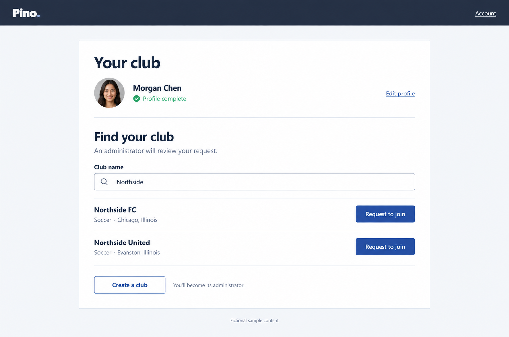
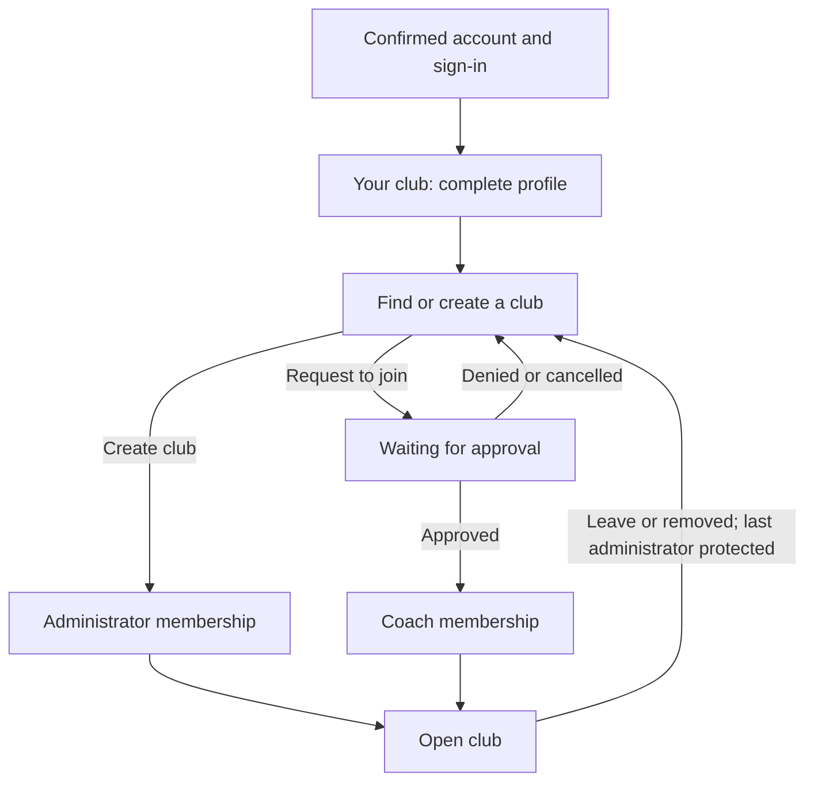

# Club onboarding and access

Status: implemented. The **Your club, one home** composition and product rules
below govern the persisted onboarding and access flow.

## Job and audience

Visitor mode: **Operate**. A newly registered coach needs to identify themselves,
find the correct club, and understand when they can start work. A club founder
needs to create a club and become its administrator. Returning staff need a clear
account of their access, while administrators need to review requests and keep
the club's membership current.

Onboarding must work on phones as well as computers. Administrative lists need
comfortable desktop scanning and complete actions on narrow screens. The first
version requires an internet connection.

## Outcome and evidence

Successful setup means a saved profile and either an active administrator
membership in a newly created club or a clearly acknowledged pending request.
Submitting a request is not membership. Approval creates a coach membership and
makes the club workspace available.

The existing application supplies Identity registration, email confirmation,
password/passkey sign-in, account management, and a fictional tryout workspace.
Club profiles, memberships, requests, server authorization, and private photos
are now persisted. Player and season workflows are implemented in the separate
[sporting workspace](club-sporting-workspace.md).
The confirmed requirements are in [PRODUCT.md](../../PRODUCT.md).
People and clubs in concept images are fictional.

## Selected direction

Inherit the **Sideline notebook** system in [DESIGN.md](../../DESIGN.md): compact
navy navigation, white working surfaces, cobalt actions, pale-blue selection,
fine rules, and readable system sans-serif type. The current tryout page was
captured to anchor the concepts in the implemented visual system. Account
scaffolding does not establish the new surface's composition.

**Your club, one home** is the selected composition. A persistent **Your club**
page carries the person's current access state. On first use its continuous white
working surface contains identity setup. Once the profile is saved, a compact
photo/name strip with **Edit profile** stays above the changing task area: club
search or creation, pending request, or active membership with **Open club**.
The focal moment is the selected club becoming a clearly acknowledged request;
the club identity stays in place as actions change to status and cancellation.

The user selected this native image-generation concept in the shaping round.
Its adjacent JSON contains the exact prompt and approval record. The image fixes
the composition and hierarchy, not literal desktop dimensions, portrait identity,
copy validation rules, or responsive behavior. Preserve the established flat
surfaces rather than any incidental shading in the generated preview. Sample
labels belong to prototypes and demonstrations, not a live persisted workflow.

[Browse, then request](../../.impeccable/mocks/decision/club-access-directory.png)
and [Choose your path](../../.impeccable/mocks/decision/club-access-paths.png) remain
unselected alternatives with their prompt provenance. No new palette, typography,
or product-wide visual-system change is proposed.

## Scope and boundaries

This brief covers profile completion with image cropping, club creation and
search, submitting/cancelling a join request, pending/denied/approved states,
administrator request review, member roles, removal, and leaving a club.

Feature homes are shared browser-compatible components under
`src/Pino.UI/Features/Clubs`, server services and authorization under
`src/Pino/Features/Clubs`, and only necessary shared contracts in
`Pino.SharedKernel`. Keep existing account pages and their static SSR behavior.
`/` and `/club/access` require authentication. The root takes existing members
to `/clubs/{clubId}`. Administrators manage `/clubs/{clubId}/people`. The public
fictional tryout remains at `/tryouts/spring-2027`, separate from club records.

Multi-club membership, a club switcher, invitations, custom roles, player/season
setup, billing, club deletion, offline support, and redesigning all account
settings are outside this brief. The [sporting workspace](club-sporting-workspace.md)
defines player, season and team permissions: coaches and administrators both
maintain those records within their club.

## Confirmed access rules

| Topic | First-version rule |
| --- | --- |
| Profile | First name, last name, and a required uploaded, croppable profile photo. |
| Club identity | Name, free-text sport and city, and a selected US state; search exposes these details, not members or players. |
| Photo privacy | Visible to self, current club staff, and administrators reviewing a pending request; only the saved square crop is retained. |
| Notifications | In-app request status; no approval emails in v1. |
| Membership | One club per person. Creating a club makes its creator an administrator. |
| Join request | One pending request per person; approval grants the coach role. |
| Cancellation | Applicants may cancel a pending request and choose another club. |
| Reapplication | A denied applicant or removed member may reapply. |
| Administration | Administrators approve/deny requests, promote/demote members, and remove access. |
| Leaving | Members may leave their own club. |
| Last administrator | Must promote another member before leaving or losing administrator access; demotion/removal cannot leave zero administrators. |

## Workflow and interaction

People with an active membership must leave it before creating or
requesting another club; there is no staged transfer or club-switching workflow.

Returning users resume the current state rather than repeating saved profile
steps. An active member can proceed to their authorized requested destination
or club workspace without an extra onboarding stop; **Your club** remains
available from their account navigation. A person without membership lands on
the access home. Treat a saved return URL as navigation intent, not authority.

1. **Complete identity.** Preserve the existing email-confirmation and sign-in
   sequence. Collect separately labelled first and last names and the profile
   photo. Explain that the photo helps club staff recognize the applicant.
   Show a crop preview with replace, reposition/zoom, cancel, and save controls.
   Saving must acknowledge the stored image, not just the local preview. Resume
   saved profile progress after sign-in; do not imply an unsubmitted local file
   survives a reload. The access gate requires a completed profile
   before club creation or request submission.
2. **Create a club.** Collect name, sport, city, and a US state. State before submission:
   "You'll become this club's first administrator." Show identity details for
   review and use **Create club** as the committing action. Success creates the
   club and administrator membership together, then offers **Open club** and
   access to member management. A newly created club has one member and no
   requests; do not invent a tryout or populate it with sample players.
3. **Find and request.** Search by club name; distinguish results using sport
   and location. Show the selected club's full identity before **Request to
   join**. Explain that approval grants coach access. Search results expose no
   roster, staff directory, or private activity. A no-results state offers
   editing the search and the explicit Create club alternative. Do not silently
   create a club when search fails or assume same-name clubs are duplicates.
4. **Wait with a clear next step.** Show the requested club, **Waiting for
   approval**, submission time, and **Cancel request**. Explain that an
   administrator must review it, without a promised response time. Returning to
   this page or checking status fetches current server state. Approval offers
   **Open club**; denial clearly states that access was not granted and offers
   another request or another club. Cancel before requesting elsewhere or
   creating a club. Do not cancel an existing request merely by browsing search.
5. **Review requests.** Administrators enter **People**, with **Requests** and
   **Members** views. Requests show photo, first/last name, request date, and
   **Approve as coach** / **Deny request**. Each decision identifies the person
   and club. Approval is a direct action with clear feedback; denial uses a
   brief confirmation. No bulk decisions or mandatory denial reason are provided
   for the first version. Zero requests is a complete, useful state.
6. **Manage members.** Show photo, full name, and readable role. Keep promotion,
   demotion, and **Remove from club** separate from request review. Confirm the
   affected person and consequence before changing a role or removing access.
   State that administrators manage membership when promoting someone. After
   self-demotion, clear administrator data and link to the person's current access. A last administrator
   sees a concrete explanation and a route back to Members to promote someone;
   a one-person club cannot be left under the confirmed rule.
7. **Leave or lose access.** **Leave club** is available from the person's club
   access page with a confirmation naming the club. Leaving/removal ends that
   membership, not the Pino account. Return to club selection, preserving the
   completed personal profile, with a clear message and the option to reapply.
   Retain club-owned records and historical attribution; ending staff access
   must not delete the club's player or placement history.

Actions show saving, success, and failure distinctly. Failed forms keep entered
text and offer retry; image controls state explicitly if the file must be chosen
again. Never show success before the server confirms it. If a response is lost,
reload authoritative status before inviting another create/approve action.

## Layout, accessibility, and content

Carry the club's identity through every access-changing action. Before membership
exists, the masthead names Pino rather than implying that the applicant already
belongs to the selected club. Show the active club once membership is granted.

Use the shared action, form, focus, and semantic notice patterns. Labels precede
inputs; state is conveyed with text. Keep crop controls keyboard-operable with
labelled alternatives to dragging. Cropping must remain usable on a phone without
requiring a precise gesture. Cropper.Blazor is supplemented with labelled
movement and zoom buttons. Controls wait for interactive rendering before input.

On narrow screens, reading and focus order follow the task. Lists become readable
stacked records, actions retain explicit labels, and selected detail screens have
a visible return action. Long names, locations, and errors wrap. Restore focus
after confirmations, move it to a new step's heading when appropriate, and
announce save/status changes without interrupting typing. Motion is restrained;
reduced motion preserves every action and message.

The access home's centered sheet becomes full-width with comfortable page
gutters on phones; the completed profile strip and club result actions stack.
Opening creation replaces the task area with a short form and a visible return
to search, retaining saved profile data. Pending and approved states keep the
same sheet and club identity. Administrator **People** views use ruled lists
with clear Requests/Members navigation, not a second onboarding wizard.

Illustrative fixtures include Morgan Chen, Northside FC (soccer, Chicago,
Illinois), and a similarly named club in another city. Exercise zero, one, and
many search results; one member who is the last administrator; multiple
administrators; no pending requests; and long names and locations. Use 25 requests
and 250 members as stress fixtures, not claimed typical sizes or product limits.
Actual data ranges remain unconfirmed. Search and pagination must not silently
truncate results or create unusably long pages.

## Material states and server boundaries

| State or race | Required handling |
| --- | --- |
| Unauthenticated or unconfirmed account | Preserve Identity's sign-in/confirmation requirements and valid local return navigation. |
| Incomplete profile | Resume identity setup; no club access is implied. |
| Missing/invalid image, failed crop or upload | Explain the affected input, retain usable progress, and offer replace/retry. |
| Search loading, no matches, or failure | Distinguish the states; failure must not look like an empty directory. |
| Pending, denied, cancelled, approved request | Show authoritative status and only valid next actions. |
| Two administrators decide one request | One final decision; the second viewer sees the current result instead of a second success. |
| Applicant cancels while approval runs | Exactly one resulting state; cancelled requests cannot later grant access. |
| Membership acquired elsewhere in another tab | Recheck before create/approve/request; never create a second membership. |
| Concurrent last-administrator changes | Preserve at least one administrator under concurrent writes, not only in the displayed list. |
| Role revoked or member removed mid-session | Revalidate protected operations and stop showing club data when revocation is detected. |
| Stale/deep-linked club URL | Check the actual club boundary on the server and provide a safe access destination. |
| Network or session loss during a write | Keep recoverable inputs, verify outcome, and prevent duplicate membership or club creation on retry. |

Authentication, completed profile, membership, role, request status, and selected
club are distinct states. Persisted records are a personal profile, club,
membership (person/club/role), and join request (person/club/status/timestamps).
The server owns their transitions and tenant checks. UI visibility, a club ID in
a route, cached claims, or a client-side role are insufficient authorization.
Pending applicants cannot read club data. Use the repository's OneOf conventions
for meaningful outcomes and preserve partial failures where storage and database
writes cannot complete together.

Profile cropping and storage must use the selected **Cropper.Blazor**,
**Aspire.Azure.Storage.Blobs**, and **Azure.Storage.Blobs** integrations. Preserve
account SSR, form, antiforgery, cookie, passkey, and reconnect behavior. New shared
interactive surfaces remain compatible with server and WebAssembly execution.
The server gateway checks current database state on every operation; the browser
gateway uses authenticated endpoints and antiforgery-protected JSON writes.
The access pages refresh every 30 seconds and provide manual status checks.
People keeps the displayed view and its rows together while loading, disables
actions until that load finishes, and ignores responses superseded by newer
navigation. A response for an earlier club must not restore its rows or errors.

## Persistence and validation details

- PostgreSQL stores club profiles, clubs, memberships, join-request history, and
  a photo-deletion queue. A user-keyed membership and filtered unique pending
  request index enforce cardinality. Transactions use a short PostgreSQL advisory
  lock across access changes, including Identity deletion, to serialize approval,
  cancellation, membership changes, and last-administrator checks across servers.
  Revisit this coarse lock only with measured contention.
- Creation carries an operation ID, unique per creator, so retries cannot create
  duplicate clubs. Names need not be unique. Search is a case-insensitive literal
  substring of the club name, with 20 results per page; People also paginates by 20.
- First and last names are required, each up to 80 characters. Club name is up to
  120, sport 60, city 100; state is one of the 50 US states. Whitespace-only values
  are rejected, and saved text is trimmed.
- Browser input accepts JPEG/PNG up to 5 MB. Cropper exports a 512 × 512 JPEG in
  chunks for server interactivity. The server bounds encoded input, inspects the
  format and dimensions, fully decodes it, and re-encodes pixels with SkiaSharp.
  Metadata and the original upload are discarded.
- Azure Blob Storage holds private crops. Every image request rechecks current
  access and uses `Cache-Control: no-store`. Replacement commits a new photo key
  and queues the old image for deletion. Failed uploads are tracked before blob
  writes; abandoned uploads become eligible for cleanup after one hour. A worker
  retries pending deletions every minute. Storage failure does not replace the
  saved profile, and cleanup failure does not report a failed profile save.
  Exhausted database retries are logged and retried on the next cleanup tick;
  they must not stop the web host.
- Identity account deletion requires leaving the current club first and queues
  its photo for deletion in the same transaction. Personal data settings expose
  an additional download containing the saved crop, names, membership, and the
  person's request history. Club records remain when a member leaves.

## Open decisions and validation

- International locations and a sport taxonomy are outside the first version.
  A self-created club is not a verified organization. Club logos are not required.
- Sporting permissions are defined in the [sporting workspace brief](club-sporting-workspace.md):
  coaches and administrators both maintain club sporting records. Typical
  club/member/request volumes remain unmeasured. Club deletion and recovery for an abandoned club
  are separate work; protecting the last administrator does not invent either.

Before shipping, verify create/join/approve/deny/cancel/reapply, each role change,
leave/removal, the last-administrator rule, direct URL access, cross-club denial,
and concurrent state changes with persisted data. Check photo/crop and the full
flow in a browser at desktop and phone widths, with keyboard use, long content,
failures, and both interactive execution modes. Follow the full solution build
and test requirements in [AGENTS.md](../../AGENTS.md).
