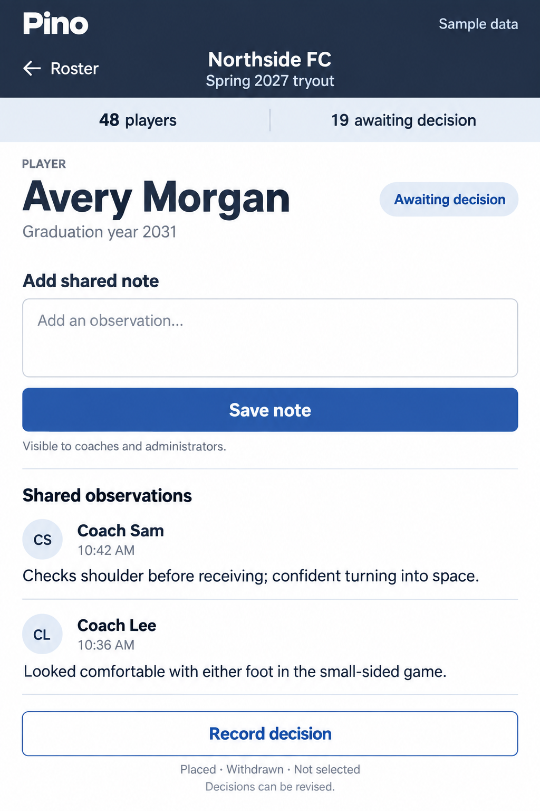

# Tryout evaluation and team placement

Status: implemented with interactive fictional sample data;
**Sideline notebook** is the selected visual direction. Confirmed
product rules and unresolved business decisions live in [PRODUCT.md](../../PRODUCT.md).

## Job and audience

Visitor mode: **Operate**. Coaches and administrators need to capture observations
on phones or tablets during a tryout, then review the roster and place players
on computers afterward. Soccer is the initial context; the workflow should also
serve other youth sports.

Success means observations are saved reliably and every participating player has
a recorded decision. Evaluation uses shared notes, without scores or a rubric.

## Selected direction

The Sideline notebook puts fast note entry first, followed immediately by recent
shared observations. Keep the player's name, graduation year, and decision clear.
Use white writing surfaces, navy navigation, blue actions, and readable sans-serif
typography. The focal action at the field is **Save note**; **Record decision** is
available as a separate action.

The mockup establishes the direction, not a pixel-exact responsive specification.
Its compact landscape rows must wrap on narrow phones. All clubs, players,
observations, times, and roster counts shown are fictional sample content.
The 48-player roster is illustrative, not a size requirement or limit.

The [Player threads](../../.impeccable/mocks/decision/player-threads.png) and
[Familiar roster](../../.impeccable/mocks/decision/familiar-roster.png) concepts
are retained as unselected alternatives. Each image has an adjacent JSON file
with its original generation prompt and approval status.

## Direction contract

**THESIS:** A coach's working notebook: find a player, write an observation,
then make a distinct placement decision. Notes lead; scoring dashboards do not.

**OWN-WORLD:** White writing surfaces, deep navy navigation, cobalt actions,
pale blue selection, restrained rounded controls and ruled observation lists.
A readable sans-serif carries the entire operational interface.

**STORY:** Staff see the club, season, remaining decisions and selected player;
save shared observations, consult earlier input, and record or revise outcomes.
Fictional data and its session-only lifetime remain explicit.

**FIRST VIEWPORT:** On desktop a compact navy masthead sits above tryout context
and whole-roster progress. A searchable roster occupies the left third; the
selected player's identity, compact composer and recent notes fill the right.
On phones the notebook fills the screen with an explicit return to the roster.
Save note is the primary action. Decision controls expand inline below notes.

**FORM:** Approved Sideline notebook, selected in the merged shaping brief;
no new seed or direction round. The user delegates remaining layout variations.
The approved image is a direction reference, explicitly not a pixel-exact spec.
The signature interaction is a saved observation joining the ruled notebook
with a brief restrained highlight, while the draft clears only on success.

**FINISH:** unreviewed and undocumented is unfinished; this build ends with the finish review, the verdict, DESIGN.md, and every shipping raster carrying its provenance

## Implemented workflow

1. **At the field:** open the tryout, find a player, add a shared observation,
   save, and return to the roster. Show note authors and times. Keep recent
   observations close to the composer so earlier staff input stays accessible.
2. **During desktop review:** show the searchable roster beside the selected
   player's notes and decision controls. Provide graduation-year, decision,
   and assigned-team filters; preserve selection and filters between players.
3. **Record a decision:** distinguish Awaiting decision from the completed
   outcomes Placed, Withdrawn, and Not selected. Coaches and administrators can
   finalize and revise outcomes directly. Team selection must enforce the
   eligibility and one-current-team-per-season rules in PRODUCT.md.
4. **Track completion:** show remaining decisions for the entire tryout even
   when the roster is filtered. Completion requires no participants awaiting
   a decision; it does not require placing everyone on a team.

## Running the sample

Open `/` or `/tryouts/spring-2027` through the Aspire web endpoint. The feature
uses `InteractiveAuto`, a dedicated tryout layout, and feature-local components
in `src/Pino.UI/Features/Tryouts`. Its per-page `SampleTryoutSession` is shared
through a notifying cascade so successful writes update notes, player status,
roster rows, history, and whole-tryout progress together.

The default roster contains 16 fictional players with eight awaiting decisions.
Search accepts names or bib numbers, with or without the displayed leading zero;
graduation, decision, and assigned-team filters combine. Selection and filters
are retained while changing players,
including when the selected player stops matching a filter after a decision.
On narrow screens, Roster returns focus to search and opening a player focuses
the notebook heading. Unsaved note drafts stay with each player while browsing.

Use **Sample controls** to load one, 16, or 96 players or an empty roster. Reset
clears all edits and drafts. The same controls simulate failed saves, lost
connections, view-only access, and a concurrent decision by another coach.
The concurrent-change simulation applies to the next valid decision save; saving
a note leaves the player's decision and the pending simulation unchanged. It
records Withdrawn, retains the user's inputs, and requires loading the latest
decision before a decision retry. Note text is retained after unsuccessful saves;
no offline storage or synchronization exists.
The 2,000-character composer bound is provisional for this demo, not an approved
product-wide note policy. Notes are append-only until editing rules are settled.

Team placements shows the current sample assignments. Revisions replace the
single current decision and append history; the sample includes an earlier-season
entry for Avery. No sample player has a placement from another tryout in the same
season, so the unresolved cross-tryout replacement policy is not fabricated.

All changes last only while this page instance exists. Reloading, leaving the
page, or losing the server circuit can discard them. No real club data, live
permissions, server concurrency, or persistence is implemented. The sample's
eligibility guard is illustrative and must also be enforced on the server when
real write endpoints are introduced. No schema changes or migrations are needed.

## States and constraints

Cover empty rosters, no search matches, no notes, loading, failed saves, lost
connections, concurrent changes, permission failures, and no eligible teams.
Keep unsuccessful note text available for retry without promising offline
capture or synchronization. Save feedback must distinguish successful writes
from pending or failed requests.

Design checks should include empty, single-player, and larger rosters, long
names, substantial notes, and content that exceeds the viewport. Actual typical
and maximum roster sizes remain unknown. Preserve logical reading and focus
order, labels, keyboard access, visible focus, contrast, comfortable touch
targets, and reduced-motion behavior.

Keep the existing Blazor architecture and account behavior. Enforce club access,
eligibility, and placement constraints on the server. Account setup, CSV import,
scores, approval workflows, and offline synchronization are outside this brief.

## Open decisions

- Who may edit or delete shared notes, and how those changes are represented.
- How revising a decision in one tryout affects a placement from another tryout
  in the same season while preserving history and one current team.
- Realistic roster sizes and the corresponding navigation and loading needs.

These questions remain open product decisions; the demo does not settle them.
The established visual system is recorded in [DESIGN.md](../../DESIGN.md).
